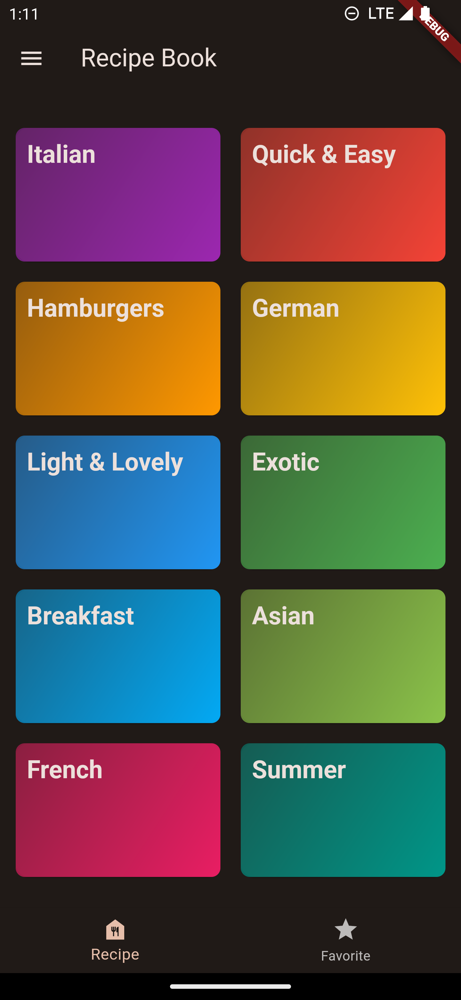
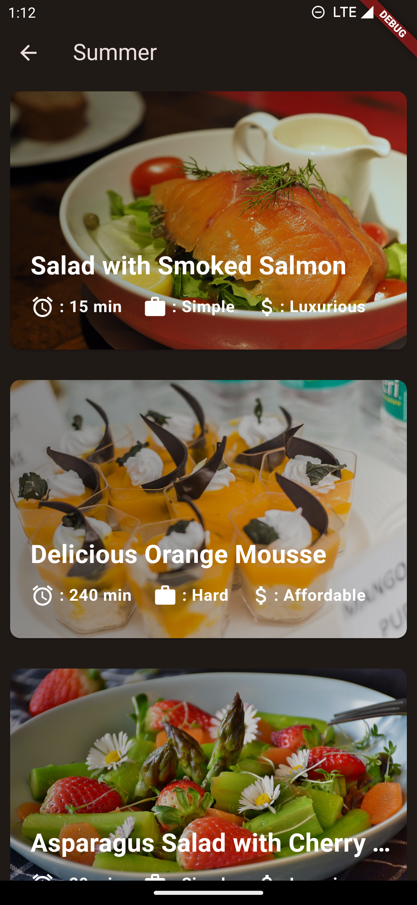
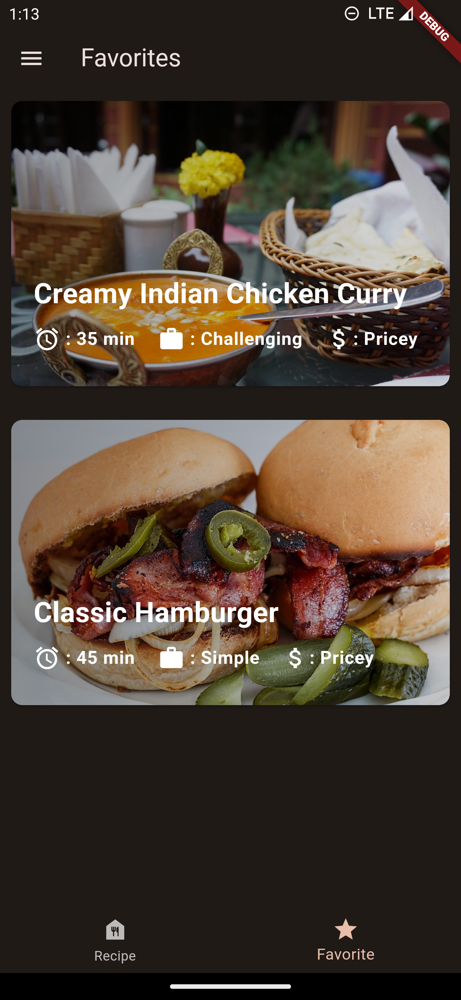
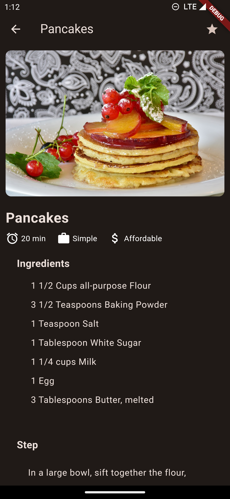

# Recipe Book

A recipe book app made in Flutter is a mobile application that allows users to access a collection of recipes in a simple and convenient way. The app is designed to be user-friendly and intuitive, making it easy for users to find, save, and share their favorite recipes.

The app's home screen displays a list of categories, such as breakfast, lunch, dinner, snacks, desserts, etc. Users can browse through the categories and select the one that interests them. Once a category is selected, a list of recipes within that category is displayed.

Users can then tap on a recipe to view its details, including the ingredients, cooking instructions, and nutritional information. They can also rate the recipe and leave comments or suggestions for other users.

The app also includes a search function that allows users to search for recipes based on keywords, ingredients, or cooking time. Additionally, users can save their favorite recipes to a "Favorites" list for easy access later.

The app also allows users to share recipes with their friends and family via social media, email, or messaging apps.

Overall, a recipe book app made in Flutter provides a convenient and user-friendly way for users to access a collection of recipes, share their favorites, and discover new ones.

---

## Screenshorts

### Home Screen

### Catogory Screen

### Favorite Screen

### Recipe Screen

---

## More About Project

A few resources to get you started if this is your first Flutter project:

- [Lab: Write your first Flutter app](https://docs.flutter.dev/get-started/codelab)
- [Cookbook: Useful Flutter samples](https://docs.flutter.dev/cookbook)

For help getting started with Flutter development, view the
[online documentation](https://docs.flutter.dev/), which offers tutorials,
samples, guidance on mobile development, and a full API reference.
